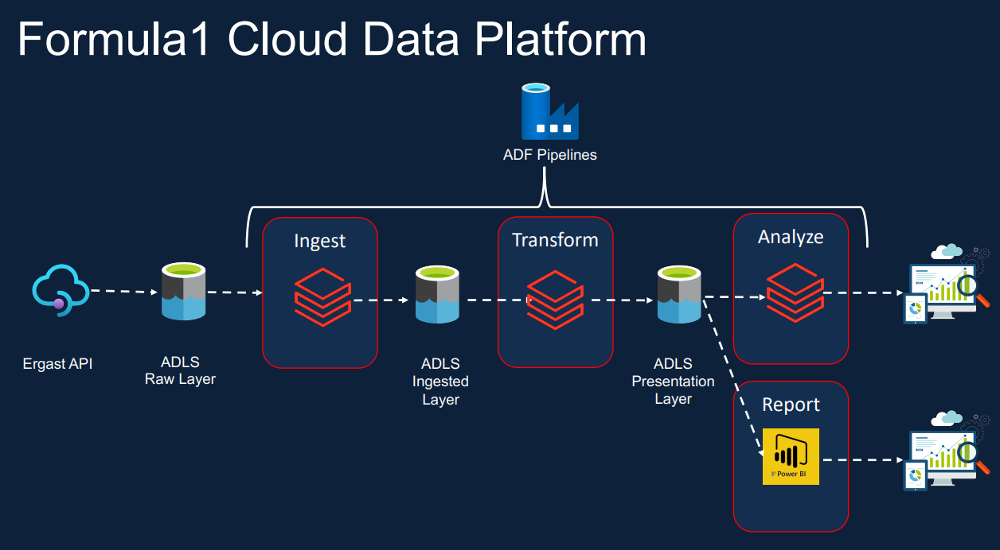
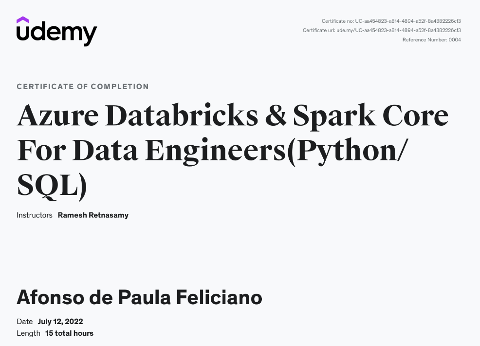

# Azure Databricks & Spark Core for Data Engineers (Python/SQL)

## ❗ Sobre o curso

### Objetivo
O objetivo deste curso é realizar um projeto aplicado nos dados da Fórmula 1 utilizando os principais conceitos e ferramentas do mercado para realização de ingestão, tratamento e disponibilização dos dados de maneira automatizada focados em Big Data Analytics.

### 👨‍💻 Sobre o Autor

O repositório original pertence ao professor Ramesh Retnasamy no qual é especialista em Arquitetura, Design, Desenvolvimento e Implementação de projetos de engenharia de dados e machine learning, atuando com Tecnologia da Informação desde 2002. 

LinkedIn: https://www.linkedin.com/in/ramesh-retnasamy/

### 💰 Adquirindo o curso

O curso pode ser adquirido em: https://www.udemy.com/course/azure-databricks-spark-core-for-data-engineers/

## 📄  que é abordado

Os principais aprendizados são focados em Azure Databricks utilizando as linguagens PySpark e SparkSQL, porém é possível visualizar algumas ferramentas da azure, tais como Key Vault, Data Factory, Data Lake Storage Gen2.

### ⚙️ Azure Databricks

O Databricks é utilizado para processamentos de grandes volumes de dados, no qual apenas o Data Factory não seria capaz de realizar os devidos tratamentos. Conta com uma gama de possibilidades, através do framework spark, podendo utilizar integrações e comunicações entre as linguagens Spark SQL, PySpark, Scala e R.

### ⚙️ Azure Data Factory

Principal ferramenta em cloud da Microsoft utilizada para tarefas de obtenção, ingestão e orquestração de dados. 

- Operações de debug, agendamentos por Event Trigger, Schedule Trigger e Tumbling Window Trigger. 
- Integração e orquestração com Databricks, Orquestração de todas as activites via pipeline. 

### 📂 Azure Data Lake Storage Gen2

Ferramentas em cloud da Microsoft utilizadas para armazenamento de arquivos focados em Big Data, controle de acessos e centralização de informações.

- Criação de Data Lake Gen2, Conainers, Upload de dados, IAM. 

- Criação de Workspace no Azure Databricks, criação de Clusters, realizando operações de mount em Storage Account, criação de notebooks, transformações via pyspark, requisição dos notebooks via ADF.

## 📄 Estruturação do curso/projeto

O projeto consiste na obtenção dos dados da Fórmula 1 via API Ergast, e armazenando os dados em uma camada raw. Após isso, são criadas pipelines e códigos para uma camada de processamento bem como uma camada de análise. 
Todo o processo é orquestrado via ADF, e, ao final de toda a esteira de dados, é possível realizar análises no próprio Databricks e/ou utilizando o Power BI.

### 📄 Módulos

- Overviews
    - Portal Azure
    - Azure Databricks
    - Projeto
- Spark
	- Databricks
	- Clusters
	- Notebooks
	- DBFS
	- Jobs
- Spark (Python)
	- Ingestão 1
	- Ingestão 2
	- Ingestão 3
	- Transformação
	- Agregações
	- Carga Incremental
- Spark (SQL)
	- Views Temporárias
	- DDL
	- DML
	- Analises
	- Cargas Incremental
- Delta Lake
	- Delta Lake
- Orquestração
	- Azure Data Factory
	- Outras ferramentas para conexão

### 📦 Fontes de dados

As fontes dos dados são da **Ergast** contendo informações das equipes, anos, pilotos, dentre outras.

### 💻 Arquitetura proposta

  

## 👨‍🎓 Conclusão

Embora já possuo alguns conhecimentos nas ferramentas, gostaria de registrar que o curso proporciona uma abordagem prática proporcionando técnicas e conceitos sobre Delta, cargas incrementais em PySpark e Spark SQL, dentre muitas outras funcionalidades que podem ser implementadas no dia a dia. Agradeço imensamente ao instrutor por todos os conhecimentos abordados.

 

Link do certificado: https://www.udemy.com/certificate/UC-aa454823-a814-4894-a52f-8a4382226cf3/

